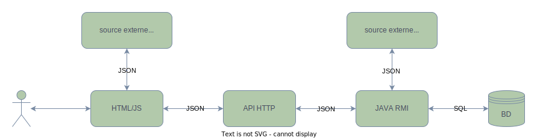
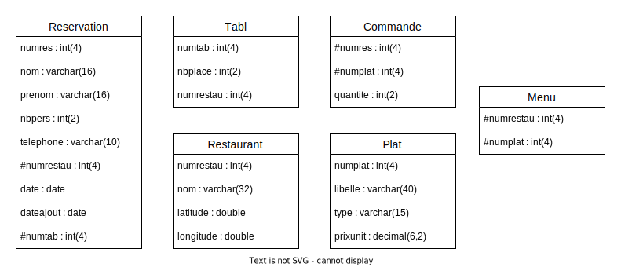

# SAE-ProgAppRep

- Hirtz Gregoire
- Mellano Louka
- Naigeon Adrien
- Reveillard Fabio

<br>

## ACTEURS



<br>


## BASE DE DONNEE



<details>
  <summary><u><strong>reservation</strong></u></summary>

- <u>`numres`</u> INT(4) AUTO_INCREMENT
- `nom` VARCHAR(16)
- `prenom` VARCHAR(16)
- `nbpers` INT(2)
- `telephone` VARCHAR(10)
- `#numrestau` INT(4)
- `date` DATE
- `dateajout` DATE
- `#numtab` INT(4)
</details>

<details>
  <summary><u><strong>restaurant</strong></u></summary>

- <u>`numrestau`</u> INT(4) AUTO_INCREMENT
- `nom` VARCHAR(32)
- `latitude` DOUBLE
- `longitude` DOUBLE
</details>

<details>
  <summary><u><strong>tabl</strong></u></summary>

- <u>`numtab`</u> INT(4) AUTO_INCREMENT
- `nbplace` INT(2)
- `numrestau` INT(4)
</details>

<details>
  <summary><u><strong>plat</strong></u></summary>

- <u>`numplat`</u> INT(4) AUTO_INCREMENT
- `libelle` VARCHAR(40)
- `type` VARCHAR(15)
- `prixunit` DECIMAL(6,2)
</details>

<details>
  <summary><u><strong>commande</strong></u></summary>

- <u>`#numres`</u> INT(4)
- <u>`#numplat`</u> INT(4)
- `quantite` INT(2)
</details>

<details>
  <summary><u><strong>menu</strong></u></summary>

- <u>`#numrestau`</u> INT(4)
- <u>`#numplat`</u> INT(4)
</details>

<br>

## API HTTP

### Récupérer la liste des restaurants
### __GET__ /restaurants
### Résultat :
```json
[
  {"numrestau":1,"nom":"Le Petit Parisien","latitude":48.8566,"longitude":2.3522},
  {"numrestau":2,"nom":"The London Pub","latitude":51.5074,"longitude":-0.1278},
  {"numrestau":3,"nom":"La Bella  Italia","latitude":41.9028,"longitude":12.4964},
  {"numrestau":4,"nom":"Tokyo Sushi House","latitude":35.6895,"longitude":139.6917}
]
```

## Récupérer les informations d'un restaurant
### __GET__ /restaurants/{*idRestaurant*}
### Résultat :
```json
{
  "numrestau":1,
  "nom":"Le Petit Parisien",
  "latitude":48.8566,
  "longitude":2.3522
}
```

## Récupérer les plats d'un restaurant
### __GET__ /plats/{*idRestaurant*}
### Résultat :
```json
[
  {"numplat":1,"libelle":"assiette de crudités","type":"Entrée","prixunit":90},
  {"numplat":2,"libelle":"tarte de saison","type":"Dessert","prixunit":90},
  {"numplat":3,"libelle":"sorbet mirabelle","type":"Dessert","prixunit":90},
  {"numplat":4,"libelle":"filet de boeuf","type":"Viande","prixunit":90},
  {"numplat":5,"libelle":"salade verte","type":"Entrée","prixunit":90},
  {"numplat":6,"libelle":"chevre chaud","type":"Entrée","prixunit":90},
  {"numplat":7,"libelle":"pate lorrain","type":"Entrée","prixunit":90},
  {"numplat":8,"libelle":"saumon fumé","type":"Entrée","prixunit":90},
  {"numplat":9,"libelle":"entrecote printaniere","type":"Viande","prixunit":90},
  {"numplat":10,"libelle":"gratin dauphinois","type":"Plat","prixunit":90},
  {"numplat":11,"libelle":"brochet à l'oseille","type":"Poisson","prixunit":90},
  {"numplat":12,"libelle":"gigot d'agneau","type":"Viande","prixunit":90},
  {"numplat":13,"libelle":"crème caramel","type":"Dessert","prixunit":90},
  {"numplat":14,"libelle":"munster au cumin","type":"Fromage","prixunit":90},
  {"numplat":15,"libelle":"filet de sole au beurre","type":"Poisson","prixunit":90},
  {"numplat":16,"libelle":"fois gras de lorraine","type":"Entrée","prixunit":90},
  {"numplat":17,"libelle":"tarte aux pommes","type":"Dessert","prixunit":90},
  {"numplat":18,"libelle":"tarte aux mirabelles","type":"Dessert","prixunit":90},
  {"numplat":19,"libelle":"tarte aux quetsches","type":"Dessert","prixunit":90},
  {"numplat":20,"libelle":"tarte aux myrtilles","type":"Dessert","prixunit":90}
]
```


## Bloquer une réservation
### __POST__ /tables/{*idRestaurant*}
### Request body :
```json
{
  "nbpers":2,
  "date":"2024-06-11"
}
```

### Résultat (le ticket) :
```json
{
  "ticket":"macUFeZlN1t0NGRkb3l0YuZh2EmWRgAgeMLEkzDiq/ZgAiyE6Df7SjxiPxi3ornjbhLZiqTJJZ64pkuvSs74QD0js3iuEKfqWqhDMso/pTust1Nxb0BX19Zz/U0S4dAs3h3rTaIu3r05fUZApl+uJY8feInHCQ6uZv6cRvZ69tmLAXrs3teTQdcj//N3Phge7KHUGHfm+9hTyZsD8dUqdASSVVBiBSoTSkf9krBbPnXKtB0d0v9xSCdFlRC5duCH17qClPjKUSiNzib+sFqemhNLZRlgdY2+Ul/t56kvZzg9CjFgs9CcphTX1AaPJqRS/RMjypdkCQ526kz2nP/UQg=="
}
```
Si la réservation est impossible, le serveur renvoie un code 400 avec le message "Réservation impossible".

## Finaliser la réservation
### __POST__ /tables
### Request body :
```json
{
  "nom":"Jean",
  "prenom":"Dupont",
  "telephone":"0606060606",
  "ticket":"macUFeZlN1t0NGRkb3l0YuZh2EmWRgAgeMLEkzDiq/ZgAiyE6Df7SjxiPxi3ornjbhLZiqTJJZ64pkuvSs74QD0js3iuEKfqWqhDMso/pTust1Nxb0BX19Zz/U0S4dAs3h3rTaIu3r05fUZApl+uJY8feInHCQ6uZv6cRvZ69tmLAXrs3teTQdcj//N3Phge7KHUGHfm+9hTyZsD8dUqdASSVVBiBSoTSkf9krBbPnXKtB0d0v9xSCdFlRC5duCH17qClPjKUSiNzib+sFqemhNLZRlgdY2+Ul/t56kvZzg9CjFgs9CcphTX1AaPJqRS/RMjypdkCQ526kz2nP/UQg=="
}
```

## Récupérer les tables d'un restaurant
### __GET__ /tables/{*idRestaurant*}
### Résultat :
```json
[
  {"numtab":1,"nbplace":2, "numrestau": 1},
  {"numtab":2,"nbplace":4, "numrestau": 1},
  {"numtab":3,"nbplace":6, "numrestau": 1},
  {"numtab":4,"nbplace":8, "numrestau": 1},
  {"numtab":5,"nbplace":6, "numrestau": 1},
  {"numtab":6,"nbplace":2, "numrestau": 1}
]
```

## Récupérer les tables libres d'un restaurant à une date donnée
### __GET__ /tables/{*idRestaurant*}/{*date*}
### Résultat :
```json
[
  {"numtab":1,"nbplace":2, "numrestau": 1},
  {"numtab":3,"nbplace":6, "numrestau": 1},
  {"numtab":6,"nbplace":2, "numrestau": 1}
]
```

## Récupérer les Incidents de circulation
### __GET__ /hazards
### Résultat :
```json
{
  "incidents": [
    {
      "type": "CONSTRUCTION",
      "description": "Chauffage urbain - Voirie: Réduction à une file de circulation, Rétrécissement des voies",
      "short_description": "Chauffage urbain - Voirie",
      "starttime": "2024-06-01T00:00:00",
      "endtime": "2024-08-30T00:00:00",
      "location": {
        "street": "Boulevard Louis Barthou",
        "polyline": "48.670705110635964 6.186903512600356",
        "location_description": "BOULEVARD LOUIS BARTHOU, VANDOEUVRE"
      },
      "source": {
        "name": "Métropole du Grand Nancy",
        "reference": "Grand_Nancy"
      },
      "updatetime": "2024-03-21T20:29:37.251429",
      "creationtime": "2024-03-21T20:29:37.251421",
      "id": "FrMdGN54180828"
    },
    "..."
  ]
}
```

